# Бот для игры «Угадай число»

Этот туториал демонстрирует создание бота, который загадывает случайное число и предлагает пользователю угадать его в процессе диалога. 

Бот будет:
- вызывать метод внешнего API и сохранять результат в переменную;
- выполнять проверку условия;
- содержать несколько веток диалога.

Пример диалога

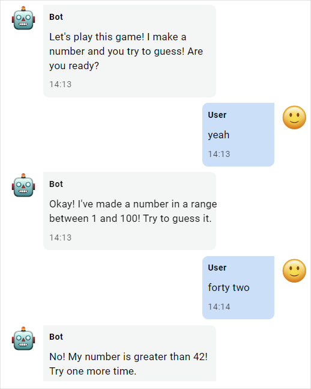

- [Перед началом работы](#перед-началом-работы)
- [Создание сценария](#создание-сценария)
  - [Начальный экран](#начальный-экран)
  - [HTTP-запрос](#http-запрос)
  - [Переход к игре](#переход-к-игре)
  - [Обработка ввода пользователя](#обработка-ввода-пользователя)
  - [Проверка условия](#проверка-условия)
  - [Ветки диалога](#ветки-диалога)
  - [Завершение сценария](#завершение-сценария)
  - [Запасной выход](#запасной-выход)
  - [Готовый сценарий](#готовый-сценарий)
- [Тестирование сценария](#тестирование-сценария)
- [Публикация бота](#публикация-бота)

## Перед началом работы

Перейдите на страницу [Aimylogic](https://app.aimylogic.com/) и войдите в аккаунт. Если у вас еще нет аккаунта, зарегистрируйтесь.

Изменить язык интерфейса можно в профиле: нажмите свой аватар в правом верхнем углу экрана и выберите *Профиль*.

## Создание сценария

1. На вкладке *Чат-боты* нажмите кнопку *Создать бота* и выберите вариант *В конструкторе*.
2. Выберите язык общения с ботом. В нашем туториале используется английский язык.
3. Выберите *Empty template*.
4. Укажите название проекта — его будете видеть только вы.
5. Нажмите *В конструктор*. В окне конструктора вы увидите пустой сценарий со списком блоков.

Окно конструктора

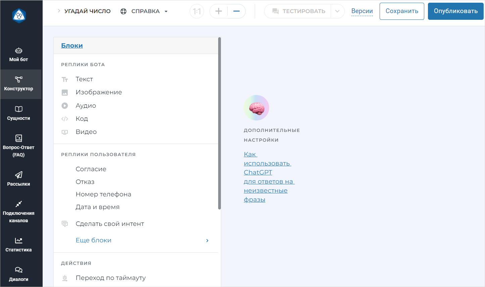

👉 Сценарий чат-бота состоит из [экранов](https://help.cloud.just-ai.com/aimylogic/basics/screen) и [блоков](https://help.cloud.just-ai.com/aimylogic/basics/blocks). Каждый блок — это действие бота. Блоки на одном экране выполняются последовательно, сверху вниз. Экраны соединяются друг с другом стрелками.

### Начальный экран

При запуске бот расскажет пользователю правила игры и предложит сыграть. 

Чтобы создать начальный экран:

1. Выберите блок *Текст* и введите в нем начальную фразу:

   `Let's play this game! I make a number and you try to guess! Are you ready?`

   Нажмите *Сохранить*.

   В окне конструктора появится первый экран:

   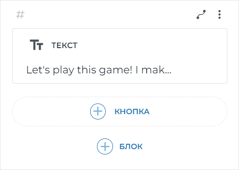

2. Чтобы добавить обработку реплики пользователя, нажмите *+Блок*. В списке блоков в разделе *Реплики пользователя* выберите *Согласие*.

   На экран добавится блок *Интенты*:

   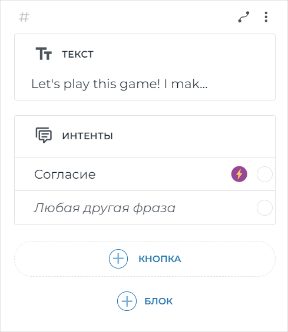

   👉 [Интент](https://help.cloud.just-ai.com/aimylogic/how-to-create-a-script/user-says/intent) — это блок в сценарии, с помощью которого бот понимает, чего хочет пользователь.

3. Снова нажмите *+Блок*. В списке блоков в разделе *Реплики пользователя* выберите *Отказ*. 

Начальный экран сценария готов.

Начальный экран

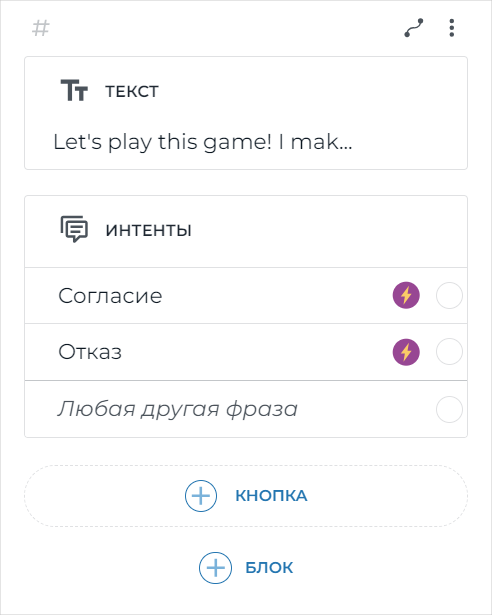

### HTTP-запрос

После получения согласия пользователя бот выполнит запрос к сервису `random.org` для получения случайного числа и сохранит результат в переменную. 

1. Нажмите интент *Согласие* на начальном экране. Появится список блоков. Прокрутите список вниз и в разделе *Действия* выберите *HTTP-запрос*. 
2. Вставьте URL для запроса:

   `https://www.random.org/integers/?num=1&min=1&max=100&col=1&base=10&format=plain&rnd=new`

3. На вкладке *Response* укажите:

   - имя переменной — `num`;
   - значение — `parseInt($httpResponse)`.
 
   

4. Нажмите *Сохранить*.

В сценарий добавится новый экран с HTTP-запросом.

Экран с HTTP-запросом

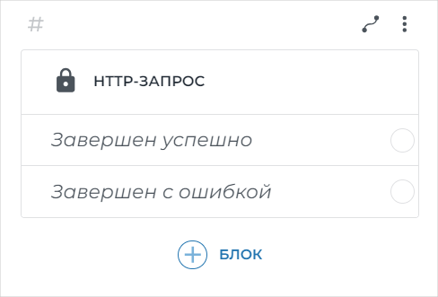

### Переход к игре

1. На экране с HTTP-запросом нажмите вариант *Завершен успешно*. В списке блоков выберите *Текст*.
2. Вставьте текст: 

   `Okay! I've made a number in a range between 1 and 100! Try to guess it.`

3. В том же окне нажмите *+Добавить другую реплику* и вставьте еще один текст:   

   `You can say "Stop" at any time to exit the game.`

4. Нажмите *Cохранить*.

5. Нажмите *+Блок* и выберите *Действия → Переход*.

Экран перехода к игре

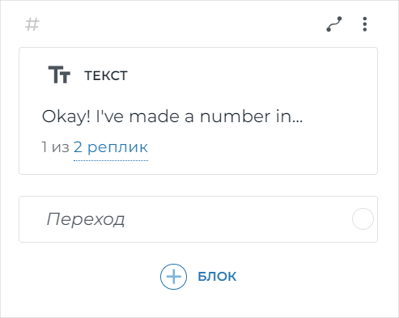

### Обработка ввода пользователя

1. На экране перехода к игре нажмите *Переход*. В списке блоков выберите *Реплики пользователя → Сделать свой интент*.

2. Вставьте значение `$NUMBER`. Нажмите *Сохранить*.

   👉 `$NUMBER` — системная переменная, которая принимает числа. 

   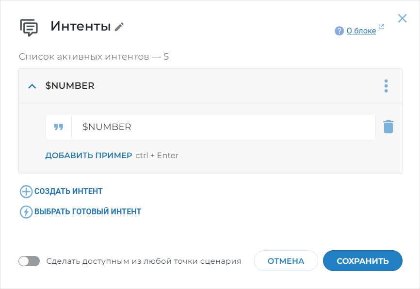

3. В том же окне нажмите *+Создать интент*. Введите `stop` и нажмите *Сохранить*.

Экран обработки ввода пользователя

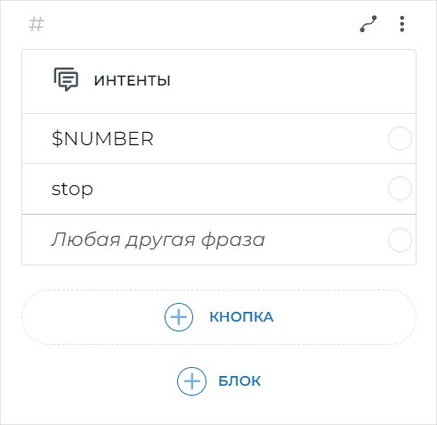

### Проверка условия

1. Нажмите значение *$NUMBER*. В списке блоков выберите *Действия → Условия*.
2. Введите первое условие:

   `$num > $NUMBER`

   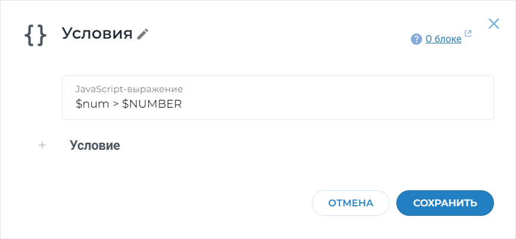

3. Нажмите *+Условие* и вставьте еще одно условие:

   `$num < $NUMBER`
  
   Нажмите *Сохранить*.

Экран проверки условия

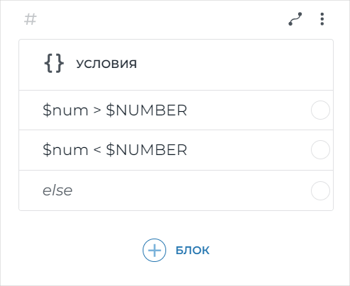

### Ветки диалога

1. На экране проверки условия нажмите вариант `$num > $NUMBER`. В списке блоков выберите *Текст*.

2. Вставьте текст:

   `No! My number is greater than $NUMBER! Try one more time.`

   Нажмите *Сохранить*.

3. Нажмите *+Блок* и выберите *Действия → Переход*.
4. Добавьте связь для возврата на экран проверки условия: нажмите кружок в блоке *Переход* и, не отпуская кнопку мыши, протяните стрелку к экрану проверки условия.
   
   

Смотреть GIF

   
   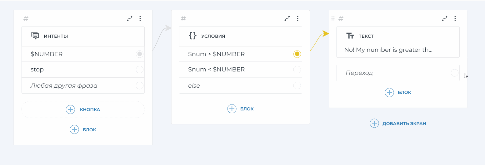
   

5. Аналогичным образом создайте экран для варианта `$num < $NUMBER` с текстом

   `No! My number is less than $NUMBER! Try one more time.`

### Завершение сценария

1. На экране проверки условия нажмите вариант `else`. В списке блоков выберите *Текст*.
2. Вставьте текст:

   `Yes! It was $num! Congratulations!`

   Нажмите *Сохранить*.

3. Нажмите *+Блок* и выберите *Действия → Завершение сценария*.

Экран завершения

   
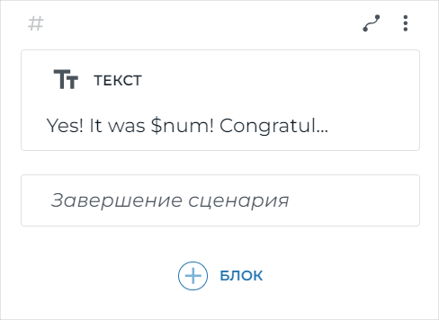

### Запасной выход

1. На начальном экране нажмите варианта *Отказ*. В списке блоков выберите *Текст*.

2. Вставьте текст:

   `Okay! See you later than!`

   Нажмите *Сохранить*.

3. Нажмите *+Блок* и выберите *Действия → Завершение сценария*.

4. Протяните стрелку от интента `stop` на экране обработки ввода пользователя к экрану запасного выхода.

### Готовый сценарий

Получившийся сценарий должен выглядеть следующим образом:

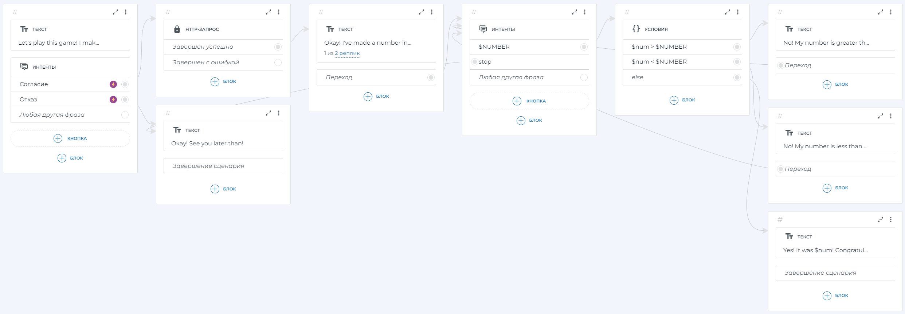

<a href='https://raw.githubusercontent.com/epiphaniea/tw-test/refs/heads/main/_images/full-script-large.png' target="_blank" rel="noopener noreferrer">Открыть в новой вкладке</a>

Нажмите кнопку *Сохранить* в правом верхнем углу, чтобы сохранить сценарий.

## Тестирование сценария

Проверьте, что бот работает корректно:

1. Нажмите кнопку *Тестировать* на верхней панели.

   Появится тестовый виджет с приветственной репликой бота.
   
2. Отвечайте на вопросы бота таким образом, чтобы проверить все ветки сценария.

Чтобы начать тестировать тот же сценарий заново, нажмите кнопку  в тестовом виджете.

Чтобы исправить ошибки в сценарии, нажмите кнопку *Остановить тест* на верхней панели, внесите изменения, а затем снова нажмите кнопку *Тестировать*.

## Публикация бота

Чтобы реальные пользователи могли общаться с вашим ботом, опубликуйте его в одном из [каналов](https://help.cloud.just-ai.com/aimylogic/publication_channels/).